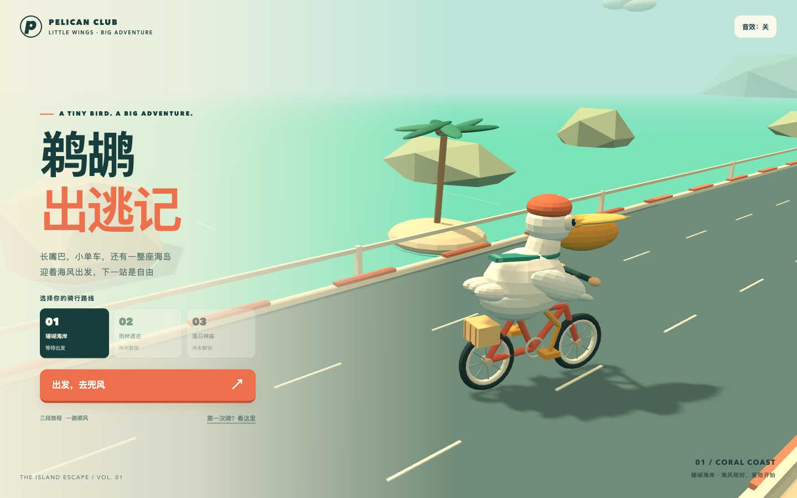

# 鹈鹕出逃记 · Pelican Pedal Run

长嘴巴，小单车，还有一整座海岛

一个使用 **Vue 3 + Vite 8 + Three.js / WebGL** 制作的 3D 骑车闯关游戏，自动向前骑行，通过变道、跳跃和低头躲开障碍，沿途收集小鱼，骑过海岸、雨林、神庙、荒漠、骷髅岛与上海滩

[在线游玩 · tihuqiche.com](https://tihuqiche.com/) · [Play in English](https://tihuqiche.com/en/) · [下载单文件 HTML](https://github.com/Licoy/tihuqiche/raw/refs/heads/main/dist/offline.html) · [构建与部署记录](https://github.com/Licoy/tihuqiche/actions/workflows/pages.yml)

> 在线地址在首次 Pages 部署成功后可用；下载 HTML 后使用浏览器打开，即可离线游玩



## 游戏内容

- 真正的 3D 鹈鹕、单车、海岛赛道与追随镜头，包含踩踏、车轮、围巾和跳跃动画
- 三条赛道左右切换，矮木栏需要跳跃，高木箱需要绕开，蓝色横杆需要低头
- 小鱼收集、一次性护盾、三点体力、暂停、关卡重试与三星评价
- 通关后解锁下一关，最高分、星级和解锁进度保存在当前浏览器中
- 支持键盘、触屏滑动与手机屏幕按钮
- 中英文界面、跟随系统语言与明暗主题，手动选择保存在当前浏览器中
- 在线版按资源文件加载，离线版内嵌 CSS、JavaScript、Logo、favicon 和 3D 引擎，一个 HTML 文件即可运行

| 关卡 | 路线 | 距离 |
| --- | --- | --- |
| 01 | 珊瑚海岸 | 600 米 |
| 02 | 雨林遗迹 | 850 米 |
| 03 | 落日神庙 | 1100 米 |
| 04 | 荒漠 | 1250 米 |
| 05 | 骷髅岛 | 1400 米 |
| 06 | 上海滩 | 1600 米 |

到达终点即可通关，保留 3 点体力并收集至少 25 条小鱼可获得三星；体力用尽可以重新挑战本关

## 如何游玩

直接用支持 WebGL 的浏览器打开 [`dist/offline.html`](dist/offline.html)，不需要启动服务器或安装依赖；也可以通过上方的在线地址游玩

| 操作 | 键盘 | 触屏 |
| --- | --- | --- |
| 左右变道 | `←` / `→` 或 `A` / `D` | 左右滑动，或点击方向按钮 |
| 跳跃 | `↑`、`W` 或空格 | 向上滑动，或点击跳跃按钮 |
| 低头 | `↓` 或 `S` | 向下滑动，或点击低头按钮 |
| 暂停 / 继续 | `P` 或 `Esc` | 点击暂停 / 继续按钮 |
| 音效 | 点击右上角音效开关 | 点击右上角音效开关 |

音效默认开启，首次点击「出发，去兜风」后激活，可通过右上角开关静音；切换到其他标签页或窗口时会自动暂停

存档属于当前浏览器和访问地址，本地文件与在线网站的进度互相独立；浏览器禁止本地存储时，游戏会提示无法保存进度

旧三关存档会保留分数和星级，已通关落日神庙的玩家会解锁荒漠；新进度使用独立的 v2 存档，原始 v1 存档保留不覆盖

外观默认跟随设备的浅色或深色设置，右上角可以选择浅色、深色或重新跟随系统；首页默认使用设备语言（中文设备显示中文，其余显示英文），手动选择优先，直接访问 `/en/` 则显示英文

## 本地开发与构建

需要 **Node.js 22.12 或更高版本** 和 **pnpm 11.24.0**，CI 使用 Node.js 24

```bash
git clone https://github.com/Licoy/tihuqiche.git
cd tihuqiche
corepack enable
pnpm install --frozen-lockfile
pnpm dev
```

开发服务器支持 Vue 单文件组件热更新；构建与预览命令如下

```bash
pnpm build
pnpm preview
```

构建首先生成在线资源，再用 Vue 服务端渲染输出中文 `dist/index.html` 和英文 `dist/en/index.html`，最后独立使用 `vite-plugin-singlefile` 生成完整内嵌的 `dist/offline.html`；在线版需通过 HTTP 服务访问，离线版可直接打开

标题、描述、关卡名称和 JSON-LD 与界面共享 `src/locales.js`、`src/levels.js`；两种语言的静态 HTML 都包含实际页面内容、canonical、hreflang、Open Graph 与 Twitter Card，不依赖执行 JavaScript 才能抓取；`public/` 提供 favicon、1200×630 分享图片、robots.txt 和 sitemap.xml

构建会检查预渲染内容与离线资源引用，并保留项目和 Three.js 的 MIT 许可证；`dist/` 随仓库保留，提交代码前请同步构建产物

场景、角色和游戏工厂保留原有模型与物理步骤，因此整体初始化函数超过 50 行，内部操作仍独立分组；这些工厂统一管理动画、事件和 GPU 资源的销毁，避免为一次性模型构造增加额外接口

## 测试

```bash
pnpm install --frozen-lockfile
pnpm exec playwright install chromium
pnpm test
```

首次安装依赖和 Chromium 需要联网，测试分别验证本地 HTTP 在线资源与离线文件；Linux 环境可以使用 `pnpm exec playwright install --with-deps chromium` 安装浏览器及系统依赖

如果本机已安装 Google Chrome，也可使用已有浏览器运行测试

```bash
PLAYWRIGHT_CHANNEL=chrome pnpm test
```

测试覆盖在线与离线加载、六关流程、存档迁移、键盘与触屏、主题和语言切换、预渲染 SEO、favicon 与分享资源，以及手机竖屏和横屏布局；关卡检查推进真实物理逻辑，触屏和设备主题检查由浏览器模拟完成

更换 Logo 后可运行 `pnpm assets` 重新生成 favicon 和分享图片，需要已安装 Playwright Chromium；使用本机 Chrome 时运行 `PLAYWRIGHT_CHANNEL=chrome pnpm assets`

界面使用从原 Logo 缩小得到的 128px 图片，内嵌后约 21KB，原图保留用于生成分享卡片

测试报告和截图写入 `test-results/`，不提交到 Git；测试使用独立浏览器上下文，不修改玩家实际存档

## GitHub Pages 自动部署

工作流位于 [`.github/workflows/pages.yml`](.github/workflows/pages.yml)，使用 GitHub 官方 Pages Actions

- 推送到 `main`：安装测试依赖 → 从源码构建 → 运行游戏测试 → 上传 `dist/` → 部署到 Pages
- 向 `main` 提交 Pull Request：仅构建和测试，通过后才适合合并
- 需要重新部署时，可在 Actions 中选择 **Build and deploy Pages → Run workflow**，使用 `main` 分支运行

首次配置或 Fork 仓库后，进入 **Settings → Pages → Build and deployment → Source**，选择 **GitHub Actions**；不需要创建 `gh-pages` 分支，也不需要配置个人访问令牌

正式访问地址为 **[https://tihuqiche.com](https://tihuqiche.com/)**，通过 GitHub Pages 托管

在 **Settings → Pages → Custom domain** 中填写 `tihuqiche.com`，DNS 校验和证书准备完成后开启 **Enforce HTTPS**；使用 Actions 自定义工作流时，域名由 Pages 设置管理，无需在源码或 `dist/` 中添加 `CNAME` 文件

中文规范地址为 `https://tihuqiche.com/`，英文为 `https://tihuqiche.com/en/`；分享图片使用可直接抓取的 `https://tihuqiche.com/share-image.png`，这些元信息不会使离线包发起资源请求

每次部署都会从 `src/` 重新构建，只发布 `dist/` 内的静态产物；构建或测试失败时停止部署，线上版本保持不变

配置方式参考 [GitHub Pages 自定义工作流文档](https://docs.github.com/en/pages/getting-started-with-github-pages/using-custom-workflows-with-github-pages)与[自定义域名文档](https://docs.github.com/en/pages/configuring-a-custom-domain-for-your-github-pages-site/managing-a-custom-domain-for-your-github-pages-site)

## 项目结构

```text
.
├── src/
│   ├── App.vue / main.js   # Vue 应用与浏览器入口
│   ├── components/        # 菜单、HUD、操作和弹窗
│   ├── styles/            # 明暗主题与响应式布局
│   ├── assets/pelican-logo.png # 鹈鹕骑车透明 Logo
│   ├── entry-server.js    # 中英文页面预渲染入口
│   ├── seo.js / locales.js # 共享元信息与双语文案
│   ├── levels.js / scenery.js # 六关配置与场景主题
│   ├── world.js / rider.js # 场景与角色模型工厂
│   └── game.js / input.js # 物理、游戏状态与输入
├── public/                # favicon、分享图、robots 和 sitemap
├── index.html / vite.config.js # Vite 页面与构建配置
├── vendor/three/           # 固定版本的 Three.js 与原始许可证
├── scripts/build.mjs      # 在线、预渲染与离线构建
├── scripts/generate-social-assets.mjs # 从现有 Logo 生成静态分享资源
├── tests/game.cjs          # Playwright 游戏检查
├── docs/preview.png        # 游戏预览
├── dist/                  # 中文首页、en/、在线资源与 offline.html
├── .github/workflows/
│   └── pages.yml           # 构建、测试和部署
├── package.json
├── pnpm-lock.yaml
└── LICENSE
```

## 社区支持
- [LinuxDO](https://linux.do)

## 许可证

项目使用 [MIT License](LICENSE)，Three.js `0.160.1` 使用其原始 [MIT License](vendor/three/LICENSE)
